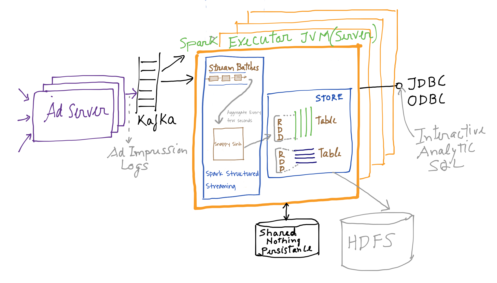

### Table of Contents
1. [Introduction](#introduction)
2. [Purpose](#purpose)
3. [Ad Analytics use case](#ad-impression-analytics-use-case)
4. [Code highlights](#code-highlights)
5. [Just want to get it running](#lets-get-this-going)
6. [Interact with the data](#next-interact-with-the-data-fast)
7. [Slack/Gitter/Stackoverflow discussion](#ask-questions-start-a-discussion)

### Introduction
[SnappyData](https://github.com/SnappyDataInc/snappydata) aims to deliver real time operational analytics at interactive speeds with commodity infrastructure and far less complexity than today. SnappyData fulfills this promise by
- enabling streaming, transactions and interactive analytics in a single unifying system rather than stitching different solutions—and
- delivering true interactive speeds via a state-of-the-art approximate query engine that leverages a multitude of synopses as well as the full dataset. SnappyData implements this by deeply integrating an in-memory database into Apache Spark.

### Purpose
Here we use a simplified Ad Analytics example, which streams in [AdImpression](https://en.wikipedia.org/wiki/Impression_(online_media)) logs, pre-aggregating the logs and ingesting into the built-in in-memory columnar store (where the data is stored both in 'exact' form as well as a stratified sample).
We showcase the following aspects of this unified cluster:
- Simplicity of using SQL or the DataFrame API to model streams in spark.
- The use of SQL/SchemaDStream API (as continuous queries) to pre-aggregate AdImpression logs (it is faster and much more convenient to incorporate more complex analytics, rather than using map-reduce).
- Demonstrate storing the pre-aggregated logs into the SnappyData columnar store with high efficiency. While the store itself provides a rich set of features like hybrid row+column store, eager replication, WAN replicas, HA, choice of memory-only, HDFS, native disk persistence, eviction, etc we only work with a column table in this simple example.
- Run OLAP queries from any SQL client both on the full data set as well as sampled data (showcasing sub-second interactive query speeds). The stratified sample allows us to manage an infinitely growing data set at a fraction of the cost otherwise required.

### Ad Impression Analytics use case
We borrow our use case implementation from this [blog](https://chimpler.wordpress.com/2014/07/01/implementing-a-real-time-data-pipeline-with-spark-streaming/) - We more or less use the same data structure and aggregation logic and we have adapted this code to showcase the SnappyData programming model extensions to Spark. We retain the native Spark example for comparison.

Our architecture is depicted in the figure below.

We consider an adnetwork where adservers log impressions in [Apache Kafka](http://kafka.apache.org/) (distributed publish-subscribe messaging system). These impressions are then aggregated by [Spark Streaming](http://spark.apache.org/streaming/) into the SnappyData Store. External clients connect to the same cluster using JDBC/ODBC and run arbitrary OLAP queries.
As AdServers can feed logs from many websites and given that each AdImpression log message represents a single Ad viewed by a user, one can expect thousands of messages every second. It is crucial that ingestion logic keeps up with the stream. To accomplish this, SnappyData collocates the store partitions with partitions created by Spark Streaming. i.e. a batch of data from the stream in each Spark executor is transformed into a compressed column batch and stored in the same JVM, avoiding redundant shuffles (except for HA).




The incoming AdImpression log is formatted as depicted below.

|timestamp              |publisher  |advertiser  | website  |geo|bid     |cookie   |
|-----------------------|-----------|------------|----------|---|--------|---------|
|2016-05-25 16:45:29.027|publisher44|advertiser11|website233|NJ |0.857122|cookie210|                           
|2016-05-25 16:45:29.027|publisher31|advertiser18|website642|WV |0.211305|cookie985|                           
|2016-05-25 16:45:29.027|publisher21|advertiser27|website966|ND |0.539119|cookie923|                           
|2016-05-25 16:45:29.027|publisher34|advertiser11|website284|WV |0.050856|cookie416|                           
|2016-05-25 16:45:29.027|publisher29|advertiser29|website836|WA |0.896101|cookie781|                           


We pre-aggregate these logs by publisher and geo, and compute the average bid, the number of impressions and the number of uniques (the number of unique users that viewed the Ad) every 2 seconds. We want to maintain the last day’s worth of data in memory for interactive analytics from external clients.
Some examples of interactive queries:
- **Find total uniques for a certain AD grouped on geography;**
- **Impression trends for advertisers over time;**
- **Top ads based on uniques count for each Geo.**

So the aggregation will look something like:

|timestamp               |publisher  |geo | avg_bid          |imps|uniques|
|------------------------|-----------|----|------------------|----|-------|
|2016-05-25 16:45:01.026 |publisher10| UT |0.5725387931435979|30  |26     |              
|2016-05-25 16:44:56.21  |publisher43| VA |0.5682680168342149|22  |20     |              
|2016-05-25 16:44:59.024 |publisher19| OH |0.5619481767564926|5   |5      |             
|2016-05-25 16:44:52.985 |publisher11| VA |0.4920346523303594|28  |21     |              
|2016-05-25 16:44:56.803 |publisher38| WI |0.4585381957119518|40  |31     |

### Code highlights
We implemented the ingestion logic using 3 methods mentioned below but only describe the SQL approach for brevity here.
- [Vanilla Spark API](https://github.com/SnappyDataInc/snappy-poc/blob/master/src/main/scala/io/snappydata/adanalytics/SparkLogAggregator.scala) (from the original blog).
- [Spark API with Snappy extensions](https://github.com/SnappyDataInc/snappy-poc/blob/master/src/main/scala/io/snappydata/adanalytics/SnappyAPILogAggregator.scala) to work with the stream as a sequence of DataFrames. (btw, SQL based access to streams is also the theme behind [Structured streaming](https://issues.apache.org/jira/browse/SPARK-8360) being introduced in Spark 2.0 )
- [SQL based](https://github.com/SnappyDataInc/snappy-poc/blob/master/src/main/scala/io/snappydata/adanalytics/SnappySQLLogAggregator.scala) - described below.

#### Generating the AdImpression logs 
A [KafkaAdImpressionGenerator](src/main/scala/io/snappydata/adanalytics/KafkaAdImpressionGenerator.scala) simulates Adservers and generates random [AdImpressionLogs](src/avro/adimpressionlog.avsc)(Avro formatted objects) in batches to Kafka.
  ```scala
  val props = new Properties()
  props.put("serializer.class", "io.snappydata.adanalytics.AdImpressionLogAvroEncoder")
  props.put("partitioner.class", "kafka.producer.DefaultPartitioner")
  props.put("key.serializer.class", "kafka.serializer.StringEncoder")
  props.put("metadata.broker.list", brokerList)
  val config = new ProducerConfig(props)
  val producer = new Producer[String, AdImpressionLog](config)
  sendToKafka(generateAdImpression())

  def generateAdImpression(): AdImpressionLog = {
    val random = new Random()
    val timestamp = System.currentTimeMillis()
    val publisher = Publishers(random.nextInt(NumPublishers))
    val advertiser = Advertisers(random.nextInt(NumAdvertisers))
    val website = s"website_${random.nextInt(Constants.NumWebsites)}.com"
    val cookie = s"cookie_${random.nextInt(Constants.NumCookies)}"
    val geo = Geos(random.nextInt(Geos.size))
    val bid = math.abs(random.nextDouble()) % 1
    val log = new AdImpressionLog()
  }
  
  def sendToKafka(log: AdImpressionLog) = {
    producer.send(new KeyedMessage[String, AdImpressionLog](
      Constants.kafkaTopic, log.getTimestamp.toString, log))
  }
  ```
#### Spark stream as SQL table and Continuous query
 [SnappySQLLogAggregator](src/main/scala/io/snappydata/adanalytics/SnappySQLLogAggregator.scala) creates a stream over the Kafka source. The messages are converted to [Row](https://spark.apache.org/docs/latest/api/java/org/apache/spark/sql/Row.html) objects using [AdImpressionToRowsConverter](src/main/scala/io/snappydata/adanalytics/AdImpressionToRowsConverter.scala) comply with the schema defined in the 'create stream table' below.
This is mostly just a SQL veneer over Spark Streaming. The stream table is also automatically registered with the SnappyData catalog so external clients can access this stream as a table.

Next, a continuous query is registered on the stream table that is used to create the aggregations we spoke about above. The query aggregates metrics for each publisher and geo every 1 second. This query runs every time a batch is emitted. It returns a SchemaDStream.

```scala
  val sc = new SparkContext(sparkConf)
  val snsc = new SnappyStreamingContext(sc, batchDuration)

  /**
  * AdImpressionStream presents the stream as a Table. It is registered with the Snappy catalog and hence queriable. 
  * Underneath the covers, this is an abstraction over a DStream. DStream batches are emitted as DataFrames here.
  */
  snsc.sql("create stream table adImpressionStream (" +
    " time_stamp timestamp," +
    " publisher string," +
    " advertiser string," +
    " website string," +
    " geo string," +
    " bid double," +
    " cookie string) " +
    " using directkafka_stream options" +
    " (storagelevel 'MEMORY_AND_DISK_SER_2'," +
    " rowConverter 'io.snappydata.adanalytics.AdImpressionToRowsConverter' ," +
    s" kafkaParams 'metadata.broker.list->$brokerList'," +
    s" topics '$kafkaTopic'," +
    " K 'java.lang.String'," +
    " V 'io.snappydata.adanalytics.AdImpressionLog', " +
    " KD 'kafka.serializer.StringDecoder', " +
    " VD 'io.snappydata.adanalytics.AdImpressionLogAvroDecoder')")
    
    // Aggregate metrics for each publisher, geo every few seconds. Just 1 second in this example.
    // With the stream registered as a table, we can execute arbitrary queries.
    // These queries run each time a batch is emitted by the stream. A continuous query.
    val resultStream : SchemaDStream = snsc.registerCQ(
    "select time_stamp, publisher, geo, avg(bid) as avg_bid," +
    " count(*) as imps , count(distinct(cookie)) as uniques" +
    " from adImpressionStream window (duration 1 seconds, slide 1 seconds)"+
    " where geo != 'unknown' group by publisher, geo, time_stamp")
```
#### Ingesting into Column table
Next, create the Column table and ingest result of continuous query of aggregating AdImpressionLogs. Here we use the Spark Data Source API to write to the aggrAdImpressions table. This will automatically localize the partitions in the data store without shuffling the data.
```scala
   snsc.sql("create table aggrAdImpressions(time_stamp timestamp, publisher string," +
    " geo string, avg_bid double, imps long, uniques long) " +
     "using column options(buckets '11')")
   //Simple in-memory partitioned, columnar table with 11 partitions. 
   //Other table types, options to replicate, persist, overflow, etc are defined 
   // here -> http://snappydatainc.github.io/snappydata/rowAndColumnTables/
  
   //Persist using the Spark DataSource API 
   resultStream.foreachDataFrame(_.write.insertInto("aggrAdImpressions"))
```

### Let's get this going
In order to run this example, we need to install the following:

1. [Apache Kafka 0.8.2.2](http://kafka.apache.org/downloads.html)
2. [SnappyData 0.3 PREVIEW release](https://github.com/SnappyDataInc/snappydata/releases/tag/v0.3-preview). Download the binary snappydata-0.3.0-PREVIEW-bin.tar.gz and Unzip it. 
The binaries will be inside "snappydata-0.3.0-PREVIEW-bin" directory.
3. JDK 7.0 or JDK 8

Then checkout the Ad analytics example
```
git clone https://github.com/SnappyDataInc/snappy-poc.git
```

Note that the instructions for kafka configuration below are for 0.8.x version of Kafka.

To setup kafka cluster, start Zookeeper first from the root kafka folder with default zookeeper.properties:
```
bin/zookeeper-server-start.sh config/zookeeper.properties
```

Start one Kafka broker with default properties:
```
bin/kafka-server-start.sh config/server.properties
```

From the root kafka folder, Create a topic "adImpressionsTopic":
```
bin/kafka-topics.sh --create --zookeeper localhost:2181 --partitions 8 --topic adImpressionsTopic --replication-factor=1
```

Next from the checkout `/snappy-poc/` directory, build the example
```
-- Build and create a jar having all dependencies in assembly/build/libs
./gradlew assemble

-- If you use IntelliJ as your IDE, you can generate the project files using
./gradlew idea    (Try ./gradlew tasks for a list of all available tasks)
```

Goto the SnappyData product install home directory.
In conf subdirectory, create file "spark-env.sh"(copy spark-env.sh.template) and add this line ...

SPARK_DIST_CLASSPATH=SNAPPY_POC_HOME/assembly/build/libs/AdImpressionLogAggr-0.3-assembly.jar
> Make sure you set the SNAPPY_POC_HOME directory appropriately above

Start SnappyData cluster using following command from installation directory. 

```
./sbin/snappy-start-all.sh
```

This will start one locator, one server and a lead node. You can understand the roles of these nodes [here](https://github.com/SnappyDataInc/snappydata/blob/master/docs/GettingStarted.md#snappydata-cluster-explanation)


Submit the streaming job to the cluster and start it (consume the stream, aggregate and store).
```
./bin/snappy-job.sh submit --lead localhost:8090 --app-name AdAnalytics --class io.snappydata.adanalytics.SnappySQLLogAggregatorJob --app-jar SNAPPY_POC_HOME/assembly/build/libs/AdImpressionLogAggr-0.3-assembly.jar --stream
```

SnappyData supports "Managed Spark Drivers" by running these in Lead nodes. So, if the driver were to fail, it can automatically re-start on a standby node. While the Lead node starts the streaming job, the actual work of parallel processing from kafka, etc is done in the Snappydata servers. Servers execute Spark Executors collocated with the data. 

Start generating and publishing logs to Kafka from the `/snappy-poc/` folder
```
./gradlew generateAdImpressions
```

You can see the Spark streaming processing batches of data once every second in the [Spark console](http://localhost:4040/streaming/). It is important that our stream processing keeps up with the input rate. So, we note that the 'Scheduling Delay' doesn't keep increasing and 'Processing time' remains less than a second.

### Next, interact with the data. Fast.
Now, we can run some interactive analytic queries on the pre-aggregated data. 
```sql
snappydata-0.3.0-PREVIEW-bin $ ./bin/snappy-shell   -- This is the interactive SQL shell
SnappyData version 1.5.0-BETA.3
snappy> connect client 'localhost:1527';   -- This is the host:port where the snappydata locator is running
Using CONNECTION0
snappy> set spark.sql.shuffle.partitions=7;  -- Set the partitions for spark shuffles low. We don't have too much data.
snappy> elapsedtime on; -- lets print the time taken for SQL commands
snappy> show members; -- List all the members in the cluster

-- You can find out if we have the ingested data?
snappy> select count(*) from aggrAdImpressions;

-- If the kafka producer is still producing, we can even directly query the stream
snappy> select count(*) from adImpressionStream;

-- Now, run Analytic queries on column table

-- Find Top 20 geographies with the most Ad impressions.
snappy> select count(*) AS adCount, geo from aggrAdImpressions group by geo order by adCount desc limit 20;
-- Find total uniques for a certain Ad grouped on geography 
snappy> select sum(uniques) AS totalUniques, geo from aggrAdImpressions where publisher='publisher11' group by geo order by totalUniques desc limit 20;

-- You can also run the above queries on the sampled data (approximate queries) by specifying error and confidence clause. 
-- If error fraction exceeds 0.20, you will get an error limit exceeded exception.
snappy> select count(*) AS adCount, geo from aggrAdImpressions group by geo order by adCount desc limit 20 with error 0.20 confidence 0.95 ;
snappy> select sum(uniques) AS totalUniques, geo from aggrAdImpressions where publisher='publisher11' group by geo order by totalUniques desc limit 20 with error 0.20 confidence 0.95 ;

-- You can still view the sample table data directly without specifying error and confidence clauses 
snappy>  select sum(uniques) AS totalUniques, geo from sampledAdImpressions where publisher='publisher11' group by geo order by totalUniques desc;
-- check the size of sample table
snappy> select count(*) as sample_cnt from sampledAdImpressions;

 
```

Finally, you can stop the SnappyData cluster using ...

```
./sbin/snappy-stop-all.sh
```

### So, what was the point again?
Hopefully we showed you how simple yet flexible it is to parallely ingest, process using SQL, run continuous queries, store in a column table and interactively query it. All in a single unified cluster. 
We will soon release Part B of this exercise - a benchmark of this use case where we compare SnappyData to other alternatives. Coming soon. 

### Ask questions, start a Discussion

[Stackoverflow](http://stackoverflow.com/questions/tagged/snappydata)     [Slack](http://snappydata-slackin.herokuapp.com/)        [Gitter](https://gitter.im/SnappyDataInc/snappydata)           [IRC](http://webchat.freenode.net/?randomnick=1&channels=%23snappydata&uio=d4)              [Reddit](https://www.reddit.com/r/snappydata)           [JIRA](https://jira.snappydata.io/projects/SNAP/issues) 

### Source code, docs
[product source](https://github.com/SnappyDataInc/snappydata)

[Product Docs](http://snappydatainc.github.io/snappydata/)

[This Example Source](https://github.com/SnappyDataInc/snappy-poc)


